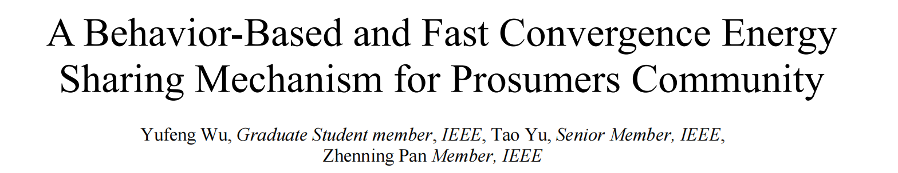

<div align="center">
  
</div>  

# Overview  
### This project is a instruction for the parameters of the case studies in our paper  _**"A Behavior-Based and Fast Convergence Energy Sharing Mechanism for Prosumers Community"**_.  
> _**two_prosumer.npy**_:The parameters of the case studies on communities with 2 prosumers.  
> _**ten_prosumer.npy**_:The parameters of the case studies on communities with 10 prosumers.  
> _**fifty_prosumer.npy**_:The parameters of the case studies on communities with 50 prosumers.  
> _**hundred_prosumer.npy**_:The parameters of the case studies on communities with 100 prosumers.
# Requirements
>Python 3  
>Numpy  
# Opening method
### Take _**two_prosumer.npy**_ as an example, run the following code in Python to open the file.  
```Python
import numpy as np
dict_ = np.load('two_prosumer.npy',allow_pickle = True).item()
```
# Parameters Description
### Our data is structured in the form of a dictionary, where the meaning of different key is explained as follows:  

>_**'E'**_ : It refers to the _**E**_ in formula (2c);  
>_**'Di'**_ : It refers to the _**D<sub>i</sub>**_ in formula (2c);  
>_**'Ai'**_ : It refers to the _**A<sub>i</sub>**_ in formula (2b);  
>_**'Bi'**_ : It refers to the _**B<sub>i</sub>**_ in formula (2b);  
>_**'Qi'**_ : It refers to the _**Q<sub>i</sub>**_ in formula (2a);  
>_**'di'**_ : It refers to the _**d<sub>i</sub>**_ in formula (2a);   
>_**'ci'**_ : It refers to the _**c<sub>i</sub>**_ in formula (2a);

# Addenda
###  There was a clerical error in Proof 6 of the original manuscript, which is corrected as follows：
<div align="center">
  
</div>  

###  And it should be noted that the proof of the CPDB is essentially the solution of the Multi-Parameter Quadratic Programming (MPQP). Due to the detailed proof of the CPDB, the elaboration of the MPQP was removed from the uploaded manuscript in order to meet the space requirements. However, due to the authors' negligence, this resulted in the removal of some important literature. For this reason, the authors provide the relevant important papers here. And the relevant content will be added to the manuscript when we restructure the manuscript in the future.

> [1] E. N. Pistikopoulos et al., Multi-Parametric Programming: Theory Algorithms and Applications, Weinheim, Germany:Wiley-VCH, 2007.

> [2] A. Grancharova and T. A. Johansen, "Multi-parametric Programming" in Explicit Nonlinear Model Predictive Control: Theory and Applications, Berlin, Heidelberg, Germany:Springer Berlin Heidelberg, pp. 1-37, 2012.

> [3] C. Lin, W. Wu, X. Chen and W. Zheng, "Decentralized dynamic economic dispatch for integrated transmission and active distribution networks using multi-parametric programming", IEEE Trans. Smart Grid, vol. 9, no. 5, pp. 4983-4993, Sep. 2018.

> [4] C. Lin, W. Wu, M. Shahidehpour, Y. Guo and B. Wang, "A non-iterative decoupled solution of the coordinated robust OPF in transmission and distribution networks with variable generating units", IEEE Trans. Sustain. Energy, vol. 11, no. 3, pp. 1579-1588, Jul. 2020.
